

<picture>
  <source media="(prefers-color-scheme: dark)" srcset="assets/hero-dark.svg">
  
</picture>

<picture>
  <source media="(prefers-color-scheme: dark)" srcset="https://readme-typing-svg.demolab.com/?font=JetBrains+Mono&weight=500&size=15&duration=3200&pause=900&center=true&vCenter=true&width=640&height=32&background=00000000&color=2DD4BF&lines=Building+LLM-powered+products+end+to+end;Agentic+workflows+%C2%B7+RAG+%C2%B7+low-latency+inference;Python+%C2%B7+Groq+%C2%B7+Supabase+%C2%B7+Vercel+%C2%B7+Hugging+Face">
  
</picture>

  
  
  <!-- TODO: replace with your portfolio URL when it ships -->
  

<picture>
  <source media="(prefers-color-scheme: dark)" srcset="assets/h-about-dark.svg">
  
</picture>

<picture>
  <source media="(prefers-color-scheme: dark)" srcset="assets/about-dark.svg">
  
</picture>

<picture>
  <source media="(prefers-color-scheme: dark)" srcset="assets/h-work-dark.svg">
  
</picture>

  <a href="https://github.com/aryanranade/finance-tracker"><picture>
    <source media="(prefers-color-scheme: dark)" srcset="assets/p-finance-tracker-dark.svg">
    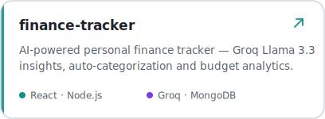
  </picture></a>
  <a href="https://github.com/aryanranade/horizon-dashboard"><picture>
    <source media="(prefers-color-scheme: dark)" srcset="assets/p-horizon-dashboard-dark.svg">
    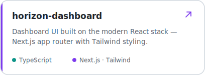
  </picture></a>

<!-- Third featured project slot — add its card here when decided. -->

<picture>
  <source media="(prefers-color-scheme: dark)" srcset="assets/h-stack-dark.svg">
  
</picture>

<samp>LANGUAGES</samp>

  
  
  
  
  

<samp>AI &amp; BACKEND</samp>

  
  
  
  
  
  

<samp>WEB &amp; TOOLS</samp>

  
  
  
  
  
  
  

<picture>
  <source media="(prefers-color-scheme: dark)" srcset="assets/h-analytics-dark.svg">
  
</picture>

  <picture>
    <source media="(prefers-color-scheme: dark)" srcset="assets/stats-dark.svg">
    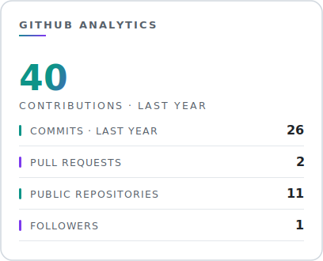
  </picture>
  <picture>
    <source media="(prefers-color-scheme: dark)" srcset="assets/langs-dark.svg">
    
  </picture>

<picture>
  <source media="(prefers-color-scheme: dark)" srcset="https://github-readme-activity-graph.vercel.app/graph?username=aryanranade&bg_color=0D1117&color=8B949E&line=2DD4BF&point=8B5CF6&area=true&area_color=2DD4BF&hide_border=true&radius=14&custom_title=Contribution%20Activity">
  
</picture>

<picture>
  <source media="(prefers-color-scheme: dark)" srcset="https://raw.githubusercontent.com/aryanranade/aryanranade/output/snake-dark.svg">
  
</picture>

<!--
  Streak card — enable when the streak is worth showing.
  (Themed to match; dark/light variants.)

<picture>
  <source media="(prefers-color-scheme: dark)" srcset="https://streak-stats.demolab.com/?user=aryanranade&background=0D1117&border=21262D&ring=2DD4BF&fire=8B5CF6&currStreakNum=E6EDF3&currStreakLabel=2DD4BF&sideNums=E6EDF3&sideLabels=8B949E&dates=8B949E&stroke=21262D">
  
</picture>
-->

<picture>
  <source media="(prefers-color-scheme: dark)" srcset="assets/h-connect-dark.svg">
  
</picture>

  <a href="mailto:aryan.a.ranade@gmail.com"><picture>
    <source media="(prefers-color-scheme: dark)" srcset="assets/c-email-dark.svg">
    
  </picture></a>
  <a href="https://www.linkedin.com/in/aryanranade"><picture>
    <source media="(prefers-color-scheme: dark)" srcset="assets/c-linkedin-dark.svg">
    
  </picture></a>
  <!-- TODO: replace with your portfolio URL when it ships -->
  <a href="https://TODO.example.com"><picture>
    <source media="(prefers-color-scheme: dark)" srcset="assets/c-portfolio-dark.svg">
    
  </picture></a>

<picture>
  <source media="(prefers-color-scheme: dark)" srcset="assets/divider-dark.svg">
  
</picture>

Cards, graphs and the snake regenerate daily via GitHub Actions.

